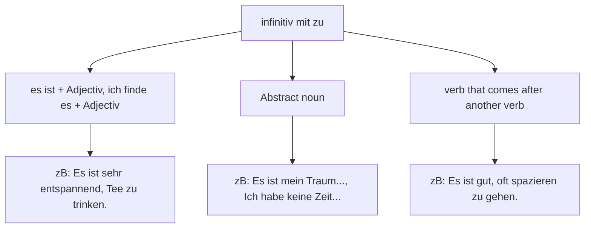

Nov 2022
   

There are three possibilities to use an infinitive with zu. 

**Positioning**

| Situation | Position |
| -- | --|
| ein Verb |  Ich fange an **zu** kochen |
| trennbare Verben|  Ich habe oft versucht dich an**zu**rufen |
| zwei Verben | Es ist gut, oft spazieren **zu** gehen |
| mit Modalverb | Es is ist mein Traum, Gittare spielen **zu** können |

By default the subject of the Nebensatz is the same as that of the Hauptsatz. 
If there is a separate subject, we need to use **dass** to refer to the second subject. 
### Consequence in nebensatz - dass
Ich hoffe, **dass** **er** pünktlich zu kommt. 
### Reasen in nebensatz - damit
Ich lüge manchmal, **damit** meine Freundin sich gut fühlt. 
