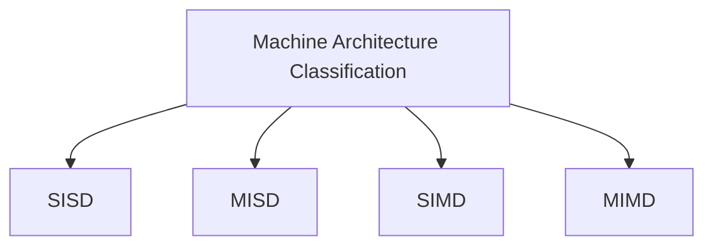

Status: #finished  
## Background
- Data Starvation Crisis: Processing improves much faster than Memory Avancements. 
- Hardware layout plays a big rule in the effectiveness of Parallel Computing. 
## **Machine Classification by Flynn**

1. **Single Instruction Single Data (SISD)**
	- Single Core machine 
	- Sequential Programming 
		![[Pasted image 20240425122306.png|500]]
1. **Multiple Instruction Single Data (MISD)**
	- **Data**<->**Multiple Processors**<-**Multiple Programs**
	- Not used for Scientific computing 
	- Used for redundancy.
		![[Pasted image 20240425122349.png|500]]
	
1. **Single Instruction Multiple Data (SIMD)**
	- **Multiple Data**<->**multiple processors**<-**single program**
	- vector architectures eg: gpus, vector units. 
			![[Pasted image 20240425123941.png|500]]
1. **Multiple Instruction Multiple Data (MIMD)**
	- **Multiple data**<->**Multiple processors**<-**Multiple Programs**
	- The data can access each other. 
	- Suitable for usage in Scientific computing, clusters etc.
		![[Pasted image 20240425124029.png|500]]

## Terminology
1. **Core:** 
	- Arithmetic Unit + Control Unit, It conduction Float and Integer operations. 
2. **CPU:** 
	- Main processing Unit with several cores caches (these days.)
3. **Cache:** 
	- Fast Indexed Memory that keeps copies of data in the main memory. 
4. **RAM**: 
	- Random access memory. Main access memory of the computer.
5. **Bus**
	- Data Transfer system. (E.g transfers data between RAM and CPU) 
	- Typically consisting of several lines. Note: A USB has a single line. 
1. **Bus-width** 
	- Number of parallel data lines in a Bus. 
2. **Band-width** 
	- Data throughput of a bus or network in Bytes/s 
3. **Latency:** 
	- Response time of bus or network or time between a query and start of an answer. 
4. **Processing node**
	- Unit of one or more CPU's with shared memory. 
5. **Cluster** 
	- Combination of several compute nodes. 
6. **Computing Power**
	- Maximum floating point operations per second (FLOPS) (Arithmetic)
	 - Moders Computers can merge addition and multiplication
7. **Thread**
	- Independently executed sequences of Instructions.  
8. **Process/Task** 
	- Instance of an application with at least one thread. 
- **UMA-Machine**: Uniform Memory Access - it takes the same  to access any location in the memory. 
- **NUMA-Machine:** non-UMA. 
-  **ccNUMA:** cache coherent NUMA - data in cache is kept valid when accessed by different cases. however this has an overhead.  
-  **ncNUMA:** non-cache coherent NUMA 
#### SIMD Work Flow 
- Check lecture notes for diagram
- In SIMD, threads have independent data but the same instructions. 
#### MIMD Work Flow
- Threads with independent data and instructions. 

---
# References
