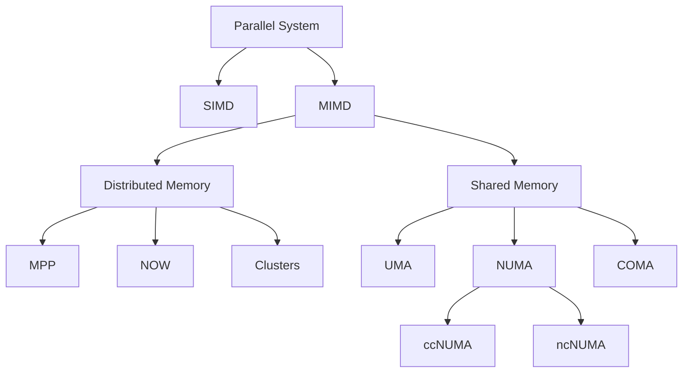

Status: #finished 
### Classification of Parallel Computers

## Classification of Memory 
### Distributed Memory
- **Architecture**
![[Pasted image 20240425130058.png|center|350]]
- **Programming Model**: *Message passing*. 
- **Types**
	- **MPP Massive Parallel System**
		- Specialized system 
		- Unified Operating system 
		- Most Super computers run this
	- **NOW Network of Workstations** 
		- Loosely connected group of individual computers with "standard" network
	- **Cluster**
		- Network of Computers with high performance network.
		- Separate instance of operating system. 
### Shared Memory
![[Pasted image 20240425125951.png|center|300]]
- **Programming model:** *Shared variables*.
- Simultaneous access to the same variable is not allowed. 
- **Types**
	- **NUMA**
		![[Pasted image 20240425151814.png]]
		- Each Processor has has a local memory which can be accessed by other processors. 
		- DIR -> Directory. Stores information regarding the files in cache. Like a registry. 
		- During memory access the DIR is read to know if the file should be accessed from the cache or from memory. 
	- **ccNUMA: Cache Coherent non-Uniform Memory Access**
	- **nccNUMA: non-ccNUMA**
	- **COMA: Cache only memory access** 
		![[Pasted image 20240425153025.png]]
		- TAG -> It is an identifier for each Datum. 
		- Datum migrates to where it is needed, hence you need a TAG to identify the data. 
		- Here the memory is accessed through the cache only. 
		- This means that this if the same data is being used, the access operation is much faster. 

### Understanding the architecture is essential to writing efficient programs. 
- **Example**: 
	- Caches are accessed in form of cache lines of fixed size - like a bus transporting people, it has the same energy is used to transport 1 person and 100 passengers. 
	- To avoid Cache misses, data should be processed continuously. (cache miss: it occurs when the program looks at the DIR and doesn't find what's required hence it searches for it in memory which is expensive)
- **Code example** 
	```c
	for (int i = 0; i < x; i++) {
	    for (int j = 0; j < y; j++) {
	        data1[i + x * j] = func(i, j); // Data 1 
	        data2[j + y * i] = func(i, j); // Data 2
	    }
	}
	```
	- `data2` is faster. Because the loop is inside (continuous `j`). 
	- `data1` has to come out of the inner loop. Hence it is slower.

### Networks
![[Pasted image 20240425155941.png]]
- Distance between nodes
	- Shortest path in # edges between two nodes. (#-> number of something )
- Degree
	- Largest number of edges at a node. 
- Diameter
	- Largest distance between two nodes. 

**Examples**
- Fully connected Network
![[Pasted image 20240425160236.png]]
- Linear network
	![[Pasted image 20240425160358.png]]
- Ring network or 1D Torus
	![[Pasted image 20240425160446.png]]
- dD Torus (d-> dimension)
	![[Pasted image 20240425160521.png]]
- D-Dimensional hypercube
	 ![[Pasted image 20240425160538.png]]
	- Nodes $N= 2^d$ 
	- Node connected with $d$ neighbours. 
	- indexed by $d$ bits. 
	- Diameter = $d$ = $\log_2 N$
	- Degree = $d$ = $\log_2 N$
	- Node index differ from neighbor's index by 1 bit.
	- Patch through the network changes bit at a time 
		- 000->001->101->111
	- Distance between nodes = # Bits different in the index
	- **Hamming Distance:** number of non-matching bits two words of same length.(How many bits have to be changed to go from one data to another data.)


