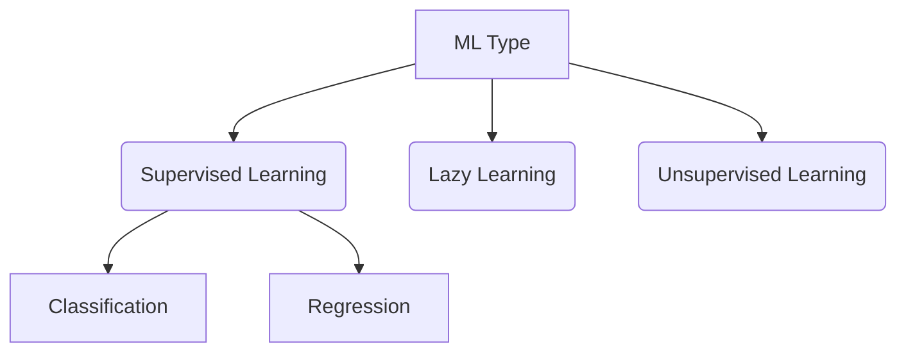

## Supervised Learning
Is a type of learning that works with labelled data such that there is a direct mapping of input data with a "correct" output data. It can be further reduced to Regression and Classification. 
- **Regression**
- **Classification**
## Unsupervised learning
Is a type of learning that works with unlabeled data. The learning algorithm looks for structure and tries to make generalizations. 
- **clustering**
- **pattern recognition**
- **prototypes for dimension reduction**
- **PCA dimension reduction********

