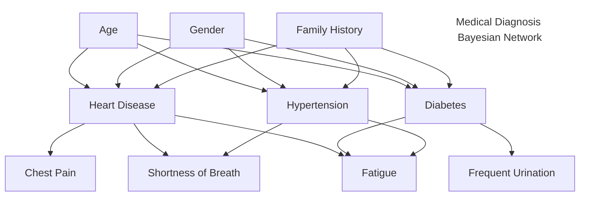

Are a representation of the probability of variables and their conditional dependencies through a graphical network. 

Where, 
- **Node:** Variable and it's associated Probability distribution. 
- **Parent Node:** Prior. 
- **Child Node:** Conditional Dependency. 

![[../Files/Pasted image 20240820112047.png|center|425]]

$$
\mathrm{P}(e)=\sum_{d \in \mathcal{D}} \mathrm{P}(e \mid d) \cdot \underbrace{\sum_{c \in \mathcal{C}} \sum_{a \in \mathcal{A}} \mathrm{P}(d \mid c, a) \cdot \mathrm{P}(a) \cdot \overbrace{\sum_{b \in \mathcal{B}} \mathrm{P}(c \mid b) \cdot \mathrm{P}(b)}^{\mathrm{P}(c)}}_{\mathrm{P}(d)}
$$
1. **Node A:** $P(a)$
2. **Node B:** $P(b)$
3. **Node C:** $P(c) = \sum_{b \in B} P(c|b) \cdot P(b)$
4. **Node D:** $P(d) = \sum_{a \in A} \sum_{c \in C} P(d|a,c) \cdot P(a) \cdot P(c)$
5. **Node E:** $P(e) = \sum_{d \in D} P(e|d) \cdot P(d)$

## Applications
- **Medical Diagnosis:** It can be used to model relationships between symptoms, diseases and risk factors. 
