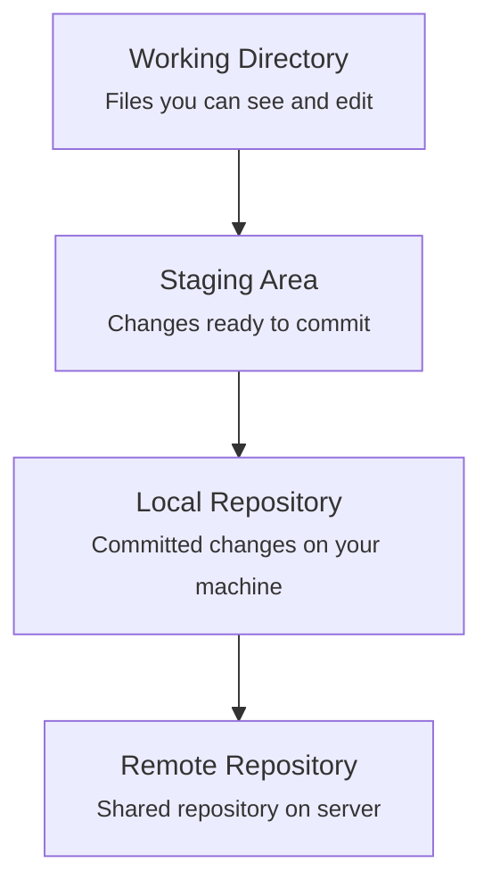
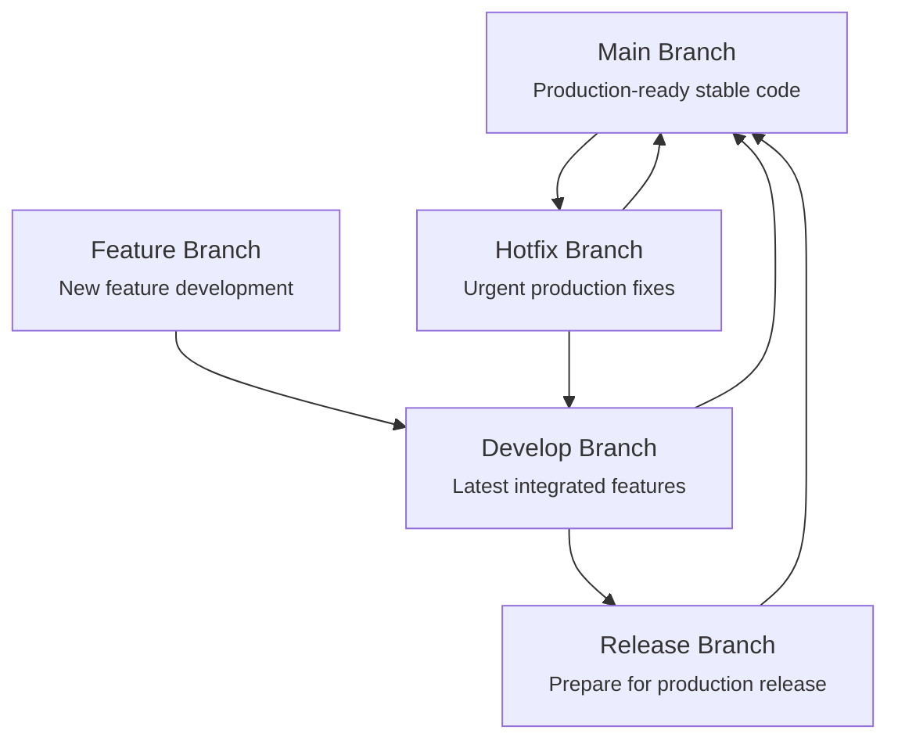

## Card 1
**Front:** What is Git?
**Back:**
A **distributed version control system (VCS)** developed by Linus Torvalds. It's used to track changes in source code, allowing multiple users to collaborate on projects efficiently. It works locally, so a server connection is not needed for most operations.

---
## Card 2
**Front:** What is a Version Control System (VCS) and what are its benefits?
**Back:**
A VCS is a system that tracks changes to files over time. Key benefits include:
* **Tracking changes** made by different contributors.
* **Rolling back** to previous versions of the code.
* Facilitating **collaboration** and code reviews.
* Allowing for seamless **branching** and **merging** of code.

---
## Card 3
**Front:** What are the 3 types of Version Control System?
**Back:**
- **Local VCS**: It stores version history in a database on a local machine only. You can track changes and revert them, but you cannot easily share or collaborate easily. Example: revision control system.  
- **Centralized VCS**: The entire project history is stored on a single central server. Users can check out files, make changes and commit back to the server. Example: CVS (Concurrent Versions System)
- **Distributed VCS**: Every developer has a full, local copy (a clone or mirror) of the entire repository and its history. This means you can work offline and generally have better performance. Changes are shared by synchronizing between repositories. *Examples: Git, Mercurial*
> ***Note: GitHub, Gitlab is a hosting platform for a distributed VCS, not a centralized VCS itself.***

---

## Card 5
**Front:** What are the basic commands to save changes to your local repository?
**Back:**
1.  **`git add <file>`**: Moves changes from the working directory to the **staging area**.
2.  **`git commit -m "message"`**: Takes the files from the staging area and saves a snapshot of them permanently to the **local repository** with a descriptive message.
3.  **`git status`**: Shows the current state of the working directory and staging area.

---

## Card 6
**Front:** What is a Git branch and why is it useful?
**Back:**
A branch is an **independent line of development**. It's useful because it allows developers to work on new features, bug fixes, or experiments in isolation without affecting the main, stable codebase. Common branch names include `main`, `develop`, and `feature` branches.

---

## Card 7
**Front:** What does `git merge` do?
**Back:**
The `git merge <branch_name>` command is used to integrate the changes from a specified branch into the current branch. This is how new features or fixes are combined back into the main line of development.

---

## Card 8
**Front:** Name the key commands for collaborating with a remote repository.
**Back:**
* **`git clone <url>`**: Creates a local copy of a remote repository.
* **`git pull`**: Fetches changes from the remote repository and merges them into your current local branch.
* **`git push`**: Uploads your committed local changes to the remote repository.

---

## Card 9
**Front:** What is a merge conflict?
**Back:**
A merge conflict occurs when two different branches or developers modify the same lines of code in a file. The version control system cannot automatically determine which changes to keep. Hence it must be manually resolved. 

---

## Card 10
**Front:** What is a Pull Request (PR)?
**Back:**
A Pull Request (PR) is a feature on platforms like GitHub/GitLab that lets developers propose changes from a **feature branch for review** before merging into the main branch. It ensures code quality through peer review.

---
## Card 
**Front:** What are the stages of file change in git?
**Back:** 

## Card 11
**Front**
What is Git's branch management philosophy?
**Back** 
Git uses different branch types to keep the main codebase stable and organized:
- **Main Branch** (`main`/`master`): Production-ready, stable code
- **Development Branch**: Integration branch where features are combined
- **Feature Branch**: For developing new features (branch from `develop`)
- **Bug-fix Branch**: For addressing specific issues or bugs. (branch from `develop`)
- **Release Branch**: For preparing releases (branch from `develop`)
- **Hotfix Branch**: For urgent production fixes (branch from `main`)

This strategy separates different types of work and maintains code stability.
