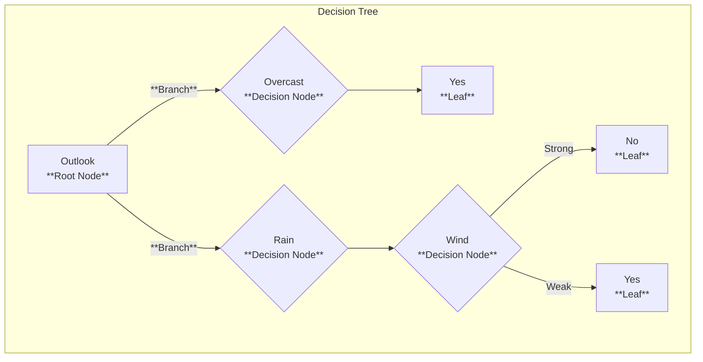

A decision tree is a model in machine learning that is used in classification tasks. 
### Components of a Decision Tree
A decision tree has a hierarchical, "inverted" tree structure with the following components:
- **Root Node:** This is the topmost node in the tree, representing the entire dataset. It's the starting point of the decision-making process.
- **Decision Nodes:** These are the internal nodes of the tree that represent a test on a specific attribute (e.g., "Wind" or "Temperature"). Each branch emerging from a decision node corresponds to a possible outcome of the test.
- **Branches:** These are the links connecting the nodes. They represent the different choices or outcomes from a decision node.
- **Leaves (Terminal Nodes):** These are the end nodes of the tree that represent a class label, which is the final outcome or decision. A leaf node indicates the classification of the instances that have reached it
## Example

